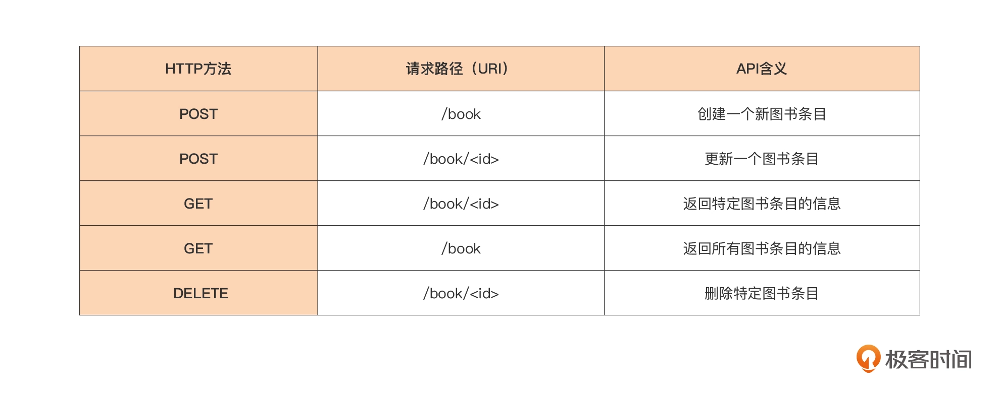
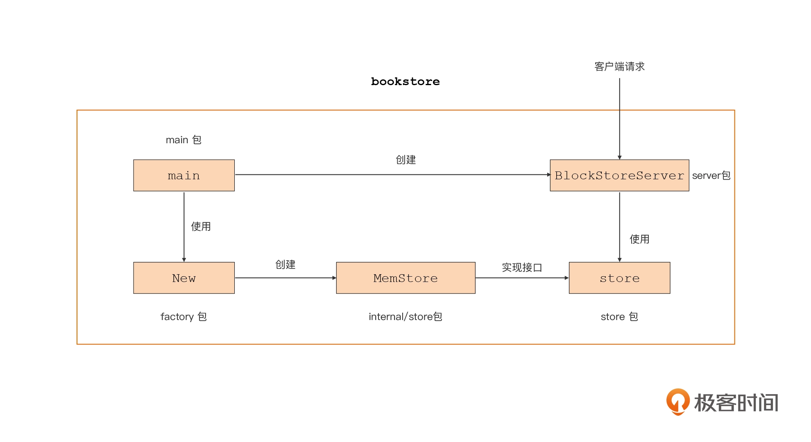

### 1. 项目目录

```shell
├── cmd/
│   └── bookstore/         // 放置bookstore main包源码
│       └── main.go
├── go.mod                 // module bookstore的go.mod
├── go.sum
├── internal/              // 存放项目内部包的目录
│   └── store/
│       └── memstore.go     
├── server/                // HTTP服务器模块
│   ├── middleware/
│   │   └── middleware.go
│   └── server.go          
└── store/                 // 图书数据存储模块
    ├── factory/
    │   └── factory.go
    └── store.go
```
### 2. go项目分为两大类：可执行程序项目和库项目

#### 2.1 可执行项目
```shell
exe-layout
├── cmd/          //cmd目录就是存放项目要编译构建的可执行文件对应的main包的源文件
│   ├── app1/
│   │   └── main.go
│   └── app2/
│       └── main.go
├── go.mod
├── go.sum
├── internal/     //只可以被本项目内部的包导入
│   ├── pkga/
│   │   └── pkg_a.go
│   └── pkgb/
│       └── pkg_b.go
├── pkg1/     //这是一个存放项目自身要使用、同样也是可执行文件对应main包所要依赖的库文件，同时这些目录下的包还可以被外部项目引用。
│   └── pkg1.go
├── pkg2/
│   └── pkg2.go
└── vendor/     //vendor是Go 1.5版本引入的用于在项目本地缓存特定版本依赖包的机制，在Go Modules机制引入前，基于vendor可以实现可重现构建，保证基于同一源码构建出的可执行程序是等价的。
```

```shell
multi-modules
├── go.mod // mainmodule
├── module1
│   └── go.mod // module1
└── module2
    └── go.mod // module2
```

```shell
single-exe-layout
├── go.mod
├── internal/
├── main.go
├── pkg1/
├── pkg2/
└── vendor/
```

#### 2.2 库项目
```shell
lib-layout
├── go.mod
├── internal/
│   ├── pkga/
│   │   └── pkg_a.go
│   └── pkgb/
│       └── pkg_b.go
├── pkg1/
│   └── pkg1.go
└── pkg2/
    └── pkg2.go
```

```shell
single-pkg-lib-layout
├── feature1.go
├── feature2.go
├── go.mod
└── internal/
```

### 3. 项目

#### 3.1 支持方法

#### 3.2 主流程

